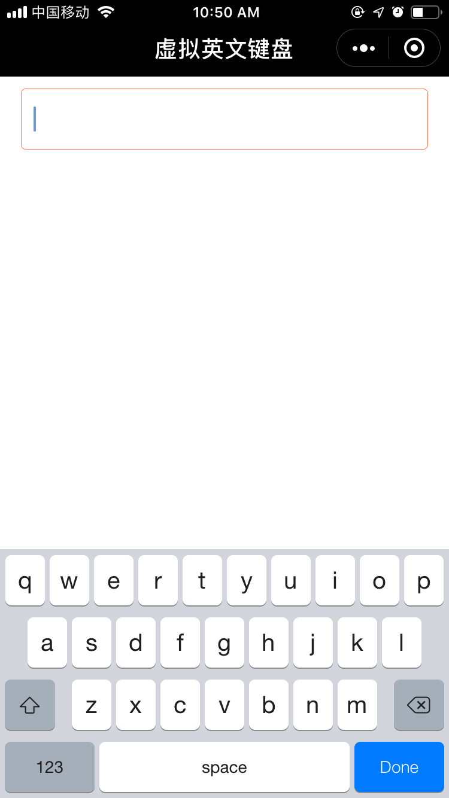
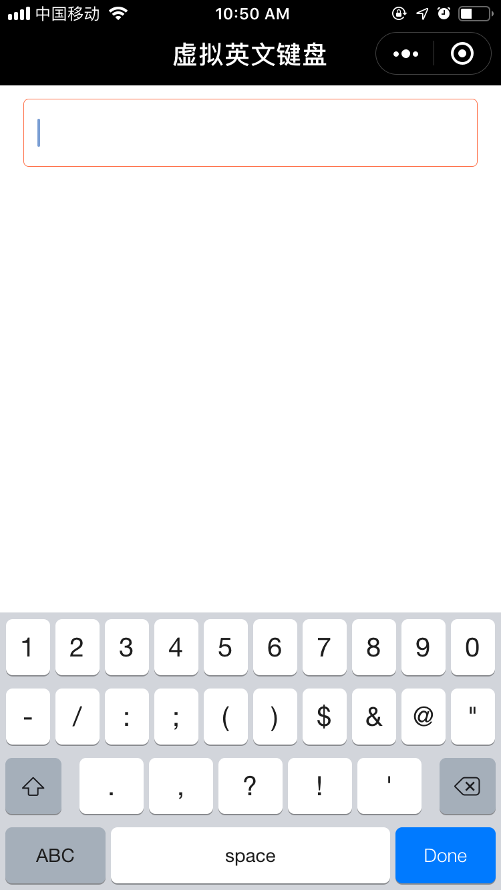

# vehicleKeyboard
微信小程序-虚拟英文输入键盘组件
--------------------------
## 需求
微信小程序不能很好控制键盘的升降。为了有更好的控制权限做了个虚拟键盘

## 效果

<div align="center">
  
  
</div>

## 功能
1. 键盘事件
    1. 输入（包括点击删除按钮）过程中会触发键盘组件的`input`事件，同时会回传当前已输入值，可捕获此事件获取键盘输入值；
    2. 点击右下角的‘完成’按钮会触发键盘组件的`done`事件，同时会回传当前已输入值，可捕获此事件然后自定义处理逻辑；
## 使用
1. 父页面配置
    1. json文件引入此组件
    ```javascript
    {
        "usingComponents": {
            "vehicleKeyboard": "/components/wx-us-keyboard/index"
         }
    }
    ```
    2. wxml文件插入此组件
    ```html
    <usKeyboard bindinput="inputChange" binddone="inputDone" id="keyboard"></usKeyboard>
    ```
    3. js文件处理键盘事件<br />
    虚拟键盘组件输入时的`inputChange`事件以及点击完成时的`inputDone`事件，具体使用可参考代码示例中**index.js**
